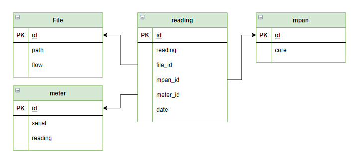
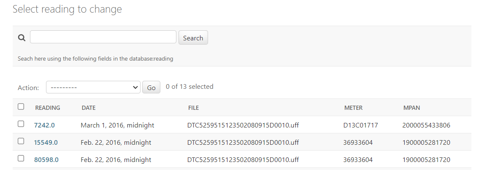
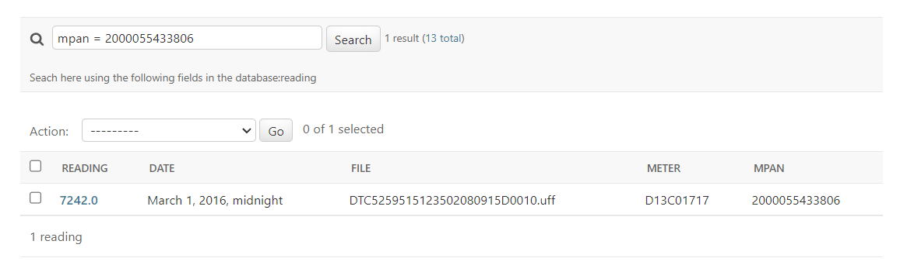

# dtc-loader
Generic Data Transfer Catalogue Loader 

This project should work as a platform to ingest and browse data flow files from the DTC catalogue.

The DTC is the data catalogue for Retail Energy Code (REC) parties, detailing the data flows that accommodate the inter-operational exchange of information and enable effective communication between industry participants via a standardised format.


Currently supported flows are:

* D0010 - Meter readings

Unsupported flow types can be ingested as files but are not parsed by the application.

## Challenge Requirements and Notes

The challenge specified the following requirements:

  * Command line interface to load file or files
  * Browsable readings in the django admin site for MPAN and meter serial numbers, with the filename that reading came in
  * Test suite and instructions on how to run tests
  * Optional, a REST api to load a file

As of now, all requirements should be satisfied BUT the REST api. I could not force the serializer to agree with the payload in the request. I have left the code in the project, with the hope to receive some much needed feedback.

## Model Design

I approached the project with the idea of laying the groundwork for a future extension to add support to more DTC data flow files. For this reason, the model is designed to allow support, in the future, of different DTC data flows.

Currently, readings stand at the center and contain reference to the related file, MPAN and meter. For the sake of this challenge, I decided to ignore all fields that are not strictly required in the challenge specifications.



## App Design

Data transformations is triggered with a post_save signal after the upload of a Data Flow file in the database. The presence of a valid flow parser (D0010 only in this version) allows to extract valid MPAN, Meters and Readings from the file and store them in the model. For this demo, I preferred to use SQLite.

Common.utils contains most of the project logic. It contains the parser factory I prepared to parse different flow files, as well as a helper class to validate readings before storage.

An upload command allows loading one or more files from the command line. Reupload of the same files is not allowed, to save space and avoid duplicateding readings.

Common.views contain the view designed to support upload through REST api, not currently working. My personal belief is that the problem stems in the serializer, but I had no time to investigate further.

The admin page allows to view the loaded readings and search for the readings associated with a MPAN or a Meter serial number. I added a ModelAdmin to improve the view of the model.



I had serious issues with the default django admin search, so I overrode the get_search_result and provided my own logic. I planned to add support for AND and OR operations but I had not the time to complete the implementation.





## Installation

You should provide your own internet connection, as well as an environment with python >= 3.10

Install the requirements:

``` 
python -m pip install -r requirements.txt 
```

Migrate the database:

``` 
python manage.py makemigrations
python manage.py migrate 
```

Create an admin account following instructions after this command:

``` 
python manage.py createsuperuser
```

## Usage

### Upload files from command line

To upload one or more files from command line, from the project root:

```
python .\manage.py upload <file_path> <file_path> <...>
```

I have attached one to the repo, for your convenience:

```
python .\manage.py upload .\DTC5259515123502080915D0010.uff
```

### Launch the server

Basic django server:

``` 
python manage.py runserver
```

You can access the admin page from:

http://127.0.0.1:8000/admin

From there you can go to the Files page to upload a new file. You don't need to specify the filename, just upload the file and the field is autocompleted.

http://127.0.0.1:8000/admin/common/file/

In the readings page you can view the loaded readings and do some basic searching operations, e.g. "meter = 36933604"

http://127.0.0.1:8000/admin/common/reading/


## Testing

After installation, you can run the suite with the following command:

```
python .\manage.py test
```

I had limited time to prepare extensive testing, but I prepared some basic classes:
* _DataFlowParserFactoryTest_: Tests the parser factory that provide the appropriate parser according to the file header;
* _D0010Test_: Tests parsing of D0010 files in various scenarios;
* _FileUploadTest_: Tests populating the File model with the example file in various scenarios;
* _FilteringAdminTest_: Tests the search admin functions of the Reading model
* _CommandTest_: Tests upload command functions for one or more files

## Resources

Documentation on the flow files headers and footers was somewhat difficult to acquire. It was not strictly necessary for this challenge, but it felt right to include it.

1. The DTC data catalogue:  
    * https://www.electralink.co.uk/dtc-catalogue/
2. Example of D0010 flow files:
    * https://gist.github.com/codeinthehole/de956088bab2a9168c7647fdf1be7cc5
3. The header and footer specifications for the flow files:
    * https://bscdocs.elexon.co.uk/user-requirements-specifications/parms-user-requirements-specification#appendix-a--data-file-formats

## Final comments

I had a lot of fun with this project, and learned a bit of django along the way.

Any feedback would be much appreciated!