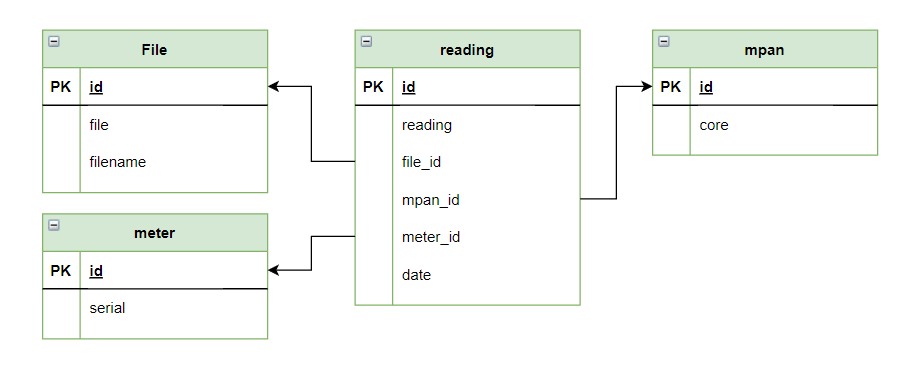

# dtc-loader
Generic Data Transfer Catalogue Loader 

This project should work as a platform to ingest and browse data flow files from the DTC catalogue.

The DTC is the data catalogue for Retail Energy Code (REC) parties, detailing the data flows that accommodate the inter-operational exchange of information and enable effective communication between industry participants via a standardised format.

Currently supported flows are:

* D0010 - Meter readings

Unsupported flow types can be ingested but are not parsed by the application.

## Challenge Requirements

* A django web application to ingest and browse D0010 files, providing:
  * A command line interface to load file or files
  * A REST api to load file or files
  * Browsable readings in the django admin site for MPAN and meter serial numbers, with the filename that reading came in
  * Test suite and instructions on how to run tests

## Model design

Since D0010 Flow is specific to meter readings, the model is based around those. Readings are not exclusive to D0010 files, but each reading is associated to a specific file, and I suppose to a specific meter and specific MPAN. Further study of the DTC flows is required to validate this solution, but was not the concern of this challenge.

## Installation

## Usage

## Testing

TODO test with multiple python versions

## Resources

`Documentation on the flow files headers and footers was somewhat difficult to acquire. It was not strictly necessary for this challenge, but it felt right to include it.`

1. The DTC data catalogue:  
    * https://www.electralink.co.uk/dtc-catalogue/
2. Example of D0010 flow files:
    * https://gist.github.com/codeinthehole/de956088bab2a9168c7647fdf1be7cc5
3. The header and footer specifications for the flow files:
    * https://bscdocs.elexon.co.uk/user-requirements-specifications/parms-user-requirements-specification#appendix-a--data-file-formats

